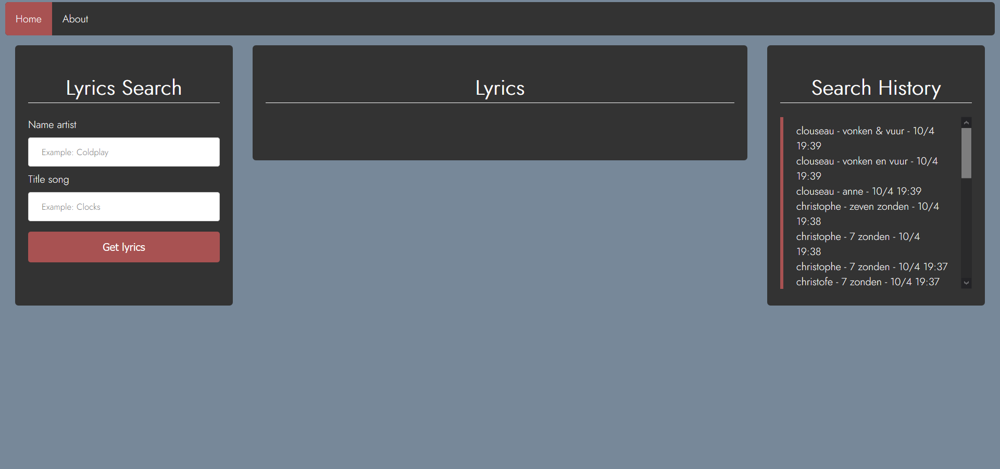

# DEV2 Werkstuk door Michalis Van Steen
Werkstuk voor het vak Web Development II waarbij gebruik gemaakt wordt van de Lyrics.ovh api.

https://lyricsovh.docs.apiary.io/#

## Concept
### Beschrijving:
Voor het concept van mijn werkstuk heb ik besloten om een website te developen waar men op een snelle en eenvoudige manier de lyrics van een lied kan opzoeken. Dit aan de hand van de artiestennaam en titel. Tevens wordt ook een zoekgeschiedenis bijgehouden waarin de gebruiker kan terugkijken naar vorige zoekresultaten.

### Design:

### Firebase:
In de Firebase wordt een lijst bijgehouden van de artiesten naam + titel van een lied wanneer de gebruiker een opzoeking uitvoerd. Wanneer het een zoekresultaat wordt verwerkt en uitgevoerd, dan worden zowel het tijdstip als de datum opgeslagen.

- Id: gegenereerd door de Firebase
- artistSong: string, voorbeeld: "Coldplay"
- titleSong: string, voorbeeld: "Clocks"
- timeStamp: string, voorbeeld: "29/04 17:25"

### Externe API:
De lyrics van de songs haal ik op uit de lyrics.ovh API.
https://lyricsovh.docs.apiary.io/#

## Netlify
https://jovial-varahamihira-7e0a17.netlify.app/

## UML

## Resources & Links
Favicon

https://www.iconninja.com/shape-brand-music-circle-note-icon-4811

Lettertype

https://fonts.google.com/specimen/Jost?category=Sans+Serif,Display,Monospace&preview.size=18&preview.text_type=paragraph&selection.family=Jost:wght@300
